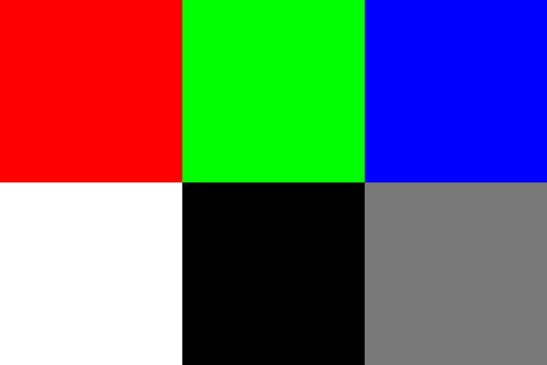

[](https://classroom.github.com/a/kNy9pn-E)
# Lab 3 - Functions sharing/calling/recursion

This lab is due on **Sunday October 6, 2024 at 23:59 MDT**.

Submit what you have to GitHub classroom by pushing to your assignment repository.

Note that GitHub Classroom's due date is in UTC time zone, not MDT.

**New policy: you may not import any external libraries other than what is supplied in the provided header file**

## Introduction
Having gotten bored of your corporate job, you join a university research team, where you will create programs to visualize beautiful fractals.
Your task for this lab is to plot the Mandelbrot set or the Julia set (depending on the input) by mapping an image to a complex plane and using the PPM format to produce an image.

## Background
### Complex numbers
Some of you may have learned about complex numbers before. If not, don't worry, they're simple to understand and we will provide you with everything you need to know about them for this lab.

The complex numbers $\mathbb{C}$, are an extension of the real numbers $\mathbb{R}$. A complex number $z\in\mathbb{C}$ is written as $z=a+ib$ where $a$ is the _real_ portion of $z$, denoted $a=Re(z)$, $b$ is the _imaginary_ portion of $z$, denoted $Im(z)$, and $i$ is the complex number satisfying $i=\sqrt{-1}$.

Complex numbers can be easily plotted on a plane called the _complex plane_ where the horizontal axis corresponds to the real component, and the vertical axis corresponds to the imaginary component. Any complex number can be plotted this way.

Relevant to this lab, we provide you with the following operations:
- **Addition**: $(a+ib)+(c+id)=(a+c)+i(b+d)$
- **Multiplication**: $(a+ib)(c+id)=(ac-bd)+i(ad+bc)$
- **Absolute Value**: $\left|a+ib\right|=\sqrt{a^{2}+b^{2}}$ (this represents the distance from $a+ib$ to the origin of the complex plane)

**Note:** You will not need to calculate square roots in this lab.

The simplest way to think about complex numbers (as far as this lab goes), is as coordinates in 2 dimensions that can be added, multiplied, etc.

### The Mandelbrot and Julia sets
The Mandelbrot set and Julia sets fractals are famous for their intricate and complex appearance despite the simplicity of the sequence from which they stem from. These fractals can be generated by iterating a complex number through a simple recursive sequence over, and over again. If the number stays finite within a certain number of iterations, then we say that that number belongs to the set, and we plot the number on an image with the colour white. If the number grows too large before the max iteration cap is hit, then we say that the number diverges, and then plot it on some gradient depending on how fast it diverges.

The **Mandelbrot Set** is the set of all complex numbers $c$ for which the sequence $z_{n+1}=z_{n}^{2}+c$ with $z_{0}=0$ has a finite limit.
- For this lab: Plot all values $c$ that cause $z_{n}$ to diverge with a fixed $z_{0}=0$, where each $c$ is mapped to a pixel in an image.

The **Julia Set** with complex constant $c$, is the set of all complex numbers $z_0$ for which the sequence $z_{n+1}=z_{n}^{2}+c$ has a finite limit.
- For this lab: Plot all values $z_{0}$ that cause $z_{n}$ to diverge with a fixed $c$ (given through input), where $z_{0}$ is mapped to a pixel in an image.

The Mandelbrot and Julia sets use the same sequence: $z_{n+1}=z_{n}^{2}+c$ The difference between them is that the Mandelbrot set plots $c$ on the image and has $z_{0}=0$, while the Julia sets plot $z_{0}$ on the image and uses any specified $c$.

## Implementation
Your solution should be written in the file `src/ex3q1.c`.

### Floating Point Representation
Depending on the input, your program may have to zoom in very deeply into the Mandelbrot set. This means that `float` will not be precise enough as `ReZ` and `ImZ` may get extremely small to the point where floating point error becomes very apparent on the final image. Therefore, for this lab **use `double` for all floating point quantities**.

### Input Specifications
The input will be given through `stdin` as in previous labs.

The first part of the input is common to both sets:
- The first input value is in the format `<int>` and represents the fractal type where **`0` corresponds to the Mandelbrot set**, and **`1` corresponds to a Julia set**. Each of the two fractals take further additional input (specified below). Any values other than `0` or `1` are considered invalid.

- The second input value is in the format `<int>` and is the maximum number of recursive calls allowed to be taken by `recursiveFractalSeq`. Your program should only accept integers larger than $0$ for this value.

$3$ additional input values (total of $5$) are given for the Mandelbrot set:
- The first two are in the format `<double> <double>` and are the coordinates of the center of the image.
- The third input value is in the format `<double>` and is the zoom factor. Your program should only accept numbers greater than $0$ for this value.

$2$ additional input values (total of $4$) are given for the Julia sets:
- These values are in the fomat `<double> <double>` and are the real and imaginary parts of $c$, `ReC` and `ImC` (remember that this value **remains constant** on every term of the sequence, only $z$ varies).

**Your program should terminate with a non-zero exit code on any invalid input.** However, you can assume that each value is formatted as specified above, and has the correct number of input values ($5$ for Mandelbrot, $4$ for Julia).

Check the [I/O examples section](#example-io) for examples of what the input will look like.


### Divergence and Recursive Functions
We can determine whether a number $z$ diverges using two conditions:
1. If at any point on the sequence's recursion, the distance from the origin (absolute value) of $z$ is larger than $2$, ($|z|>2$), then $z_n$ inevitably diverges.
2. If the recursion count on the sequence $z_n$ hits some set recursion cap `maxIterations` (provided as input), then we can say that that $z$ does not diverge.

After determining whether $z_n$ diverges or not, we can plot the corresponding number on the plane: Mandelbrot set plots $c$, while Julia sets plot $z_0$.

You're provided with a header file named `ex3q1.h` located in the source directory `src`.

The header file looks as follows:
```C
#include <stdio.h>
#include <stdlib.h>

int imageH = 720;

int recursiveFractalSeq(double ReC, double ImC, double ReZ, double ImZ, int depth, int maxIterations);
```

Create a file named `ex3q1.c` in `src` and include the header file by writing `#include "ex3q1.h"` at the top. This enables you to implement `recursiveFractalSeq` directly in `ex3q1.c`.

`recursiveFractalSeq` will be implemented by you and should do the following:
1. Use recursion to calculate $z_{n+1}$, given $z_n$ and $c$ using the recursive fractal sequence $z_{n+1}=z_{n}^{2}+c$.
2. Return the total number of iterations taken to either
    - **a)** $|z|>2$ (number diverges), or
    - **b)** the recursion depth hits the max recursion cap (which is given from input).

The entire program relies on this function. We **strongly recommend** ensuring this function works properly before troubleshooting later parts of the lab.

**Important**: DO NOT CHANGE THE HEADER FILE `ex3q1.h` IN ANY WAY. The function prototype of `recursiveFractalSeq` will be used for testing your program so DO NOT change its prototype. However, you may (and are encouraged to) create and implement your own functions throughout this program as long as you don't edit the header file.

**New policy: you may not import any external libraries other than what is supplied in the provided header file. The needed libraries (stdio and stdlib) are provided in the header file.**

### Pixels and Plane Coordinates
Remember: A complex number is equivalent to a coordinate on the complex plane.

In order to evaluate the value of each pixel, each pixel must be mapped to a complex number. For the Mandelbrot Set, we know that each pixel maps to $c$, while in Julia Sets each pixel maps to the initial value of $z$ ($z_{0}$).

Given this, it is important to know dimension specifications:
- The final image will have a width and a height measured in pixels (`imgW`, `imgH`) and the complex plane will have its own width and height (`planeW`, `planeH`). You will have to convert between image coordinates and complex numbers in order to colour each pixel correctly.
- Complex plane dimensions are determined by the type of fractal to be generated and will always be the same for each respective fractal.
- The final image should always have `imgH = 720`, and `imgW` is determined by matching the aspect ratio of the complex plane.
- You should use the complex number at the **center** of the pixel (hint: the coordinates will be shifted by $\frac{1}{2}$ of the pixel width relative to the edge)

#### Dimensions and center coordinates for the **Mandelbrot Set**
- The complex plane should have a starting **width of $3$ (real units)**, and a **height of $2$ (imaginary units)**. Additionally, you should scale the complex plane dimensions by `1 / zoomFactor` before continuing.
- The center coordinates are given as input, so you should shift the plane accordingly.


#### Dimensions and center coordinates for **Julia Sets**
- The complex plane should have a fixed **width of $4$ (real units)** and **height of $3$ (imaginary units)** since there is no zooming.
- The center coordinates should always be $(0, 0)$ (aka $0+0i$).

Given the dimensions and center coordinates, its easy to see that Julia sets are displayed from $-2$ to $2$ in the real axis and from $-1.5$ to $1.5$ in the imaginary axis.


### Calculating Color
Next, you have to map the divergence results for each pixel to a color.

The coloring scheme we use for this lab is as follows:
- If the sequence converges at the given value, the pixel is white `(255, 255, 255)`.
- Otherwise, the pixel is calculated on a linear gradient based on an alpha value between $0$ and $1$. This value should be calculated as the proportion towards the maximum recursion depth (i.e. how "fast" this point diverges): $\alpha = \text{value}/\text{maxIterations}$.
- Having calculated $\alpha$, the resulting color $$(r, g, b) = \alpha (0, 255, 153)$$
- The resulting gradient shifts from greyscale to green, which offers better visual clarity (like in night vision goggles).

### Producing a Final Image Using the PPM Image Format
For this lab, the final output should be an image in the PPM format. You can learn more about this format [here](https://netpbm.sourceforge.net/doc/ppm.html), or read the below section for the relevant information.

**Note:**: Since you have not yet learned file I/O, you should simply output with `printf` as before. If you want to save the image, you can use file redirection (`./ex3q1 >output.ppm`). Our marking scripts will catch this output automatically.

Here is an example Portable Pixel Map (PPM) image:

```
P3
3 2
255
255 0 0 0 255 0 0 0 255
255 255 255 0 0 0 120 120 120
```

The first 3 lines is the header and should always be the following:
- `P3` specifies that this PPM file is in ASCII.
- `3 2` are the image width and image height. Change these accordingly to your image.
- `255` specifies the maximum value for intensity. Since we will be using the RGB colour format, 255 is what you should use. This means that white is represented as `255 255 255`, red is `255 0 0`, black is `0 0 0`, etc.

The lines after the header represent pixels:
- Each pixel consists of 3 integers from $0$ to $255$, representing the R, G, B values
- Each pixel is sequentially written from left to right then top to bottom according to the image width and height specified in the header.
- Each integer value can be separated with any whitespace. The extra spaces and newlines in the example were added for visual clarity

This results in the image:



**TIP:** Writing to the image in order from (in image coordinates) `0,0`, to `imgW-1,imgH-1` will result in an upside down image. This is because the first pixel written to a PPM file is always the top left corner of the image. **Make sure your image is not upside down**.

### Viewing PPM Images

You are provided with a program named `viewppm`. This program will take a path to a PPM file as an argument, and display the image on the terminal, including colors. An example on how to use this is `./viewppm Testcases/12_output.ppm`. This will display a very low quality version of the image.

**MAC USERS:** The default terminal in Mac does not support 24-bit colors and so the colors of the output of `viewppm` are slightly off.

`viewppm` is meant to be used to quickly test your program and to make sure that your PPM files are formatted correctly.

To view the image at its full resolution, you have some other options:[This website](https://www.cs.rhodes.edu/welshc/COMP141_F16/ppmReader.html), or if you use Visual Studio Code you can use [this extension](https://marketplace.visualstudio.com/items?itemName=ngtystr.ppm-pgm-viewer-for-vscode) to view them directly in the IDE. Make sure that the file extension is `.ppm`.

### Comparing Images

There is a lot of room for error in this lab, and since the output is so large we will accept solutions _slightly_ off.

You are provided with a python file named `ppmcmp.py`.

This program requires two positional arguments:
1. PPM image path 1
2. PPM image path 2

The output of this program is a real number in the range $[0,255\sqrt{3}]$. This value represents the average Cartesian distance between each pixel of images 1 and 2 after applying a Gaussian Blur. Basically, the larger the output of this program, the less similar both images are.

An output of $0$ signifies that both images are identical, while an output of $255\sqrt{3}=441.67$, the maximum possible value, occurs when one image is completely white, and the other completely black.

**Your solution is considered passable if the output of `ppmcmp.py` is $\le5$**. Note that if your image barely passes on one example, there may be drastically different results on other examples depending on your mistake, so please test your program thoroughly.

## Example I/O

### Mandelbrot Sets

#### Example 1:

Input:
```
0 1000 -1.0 0.0 1.0
```

Output:


#### Example 2
Input:
```
0 500 -1.768778833 -0.0017389 3000000.0
```

Output:


#### Example 3
Input:
```
0 500 -0.776592847 -0.136640848 100.0
```

Output:


### Julia Sets

#### Example 1
Input:
```
1 100 -0.795814377 -0.19144677
```

Output:


#### Example 2
Input:
```
1 300 -0.5251993 -0.5251993
```

Output:


#### Example 3
Input:
```
1 1000 -0.755199307 -0.052859619
```

Output:


## Checking

As always: You are provided with a script that checks your program named `check.sh`, this script will compare your program's output to the expected output. To pass `check.sh`, your program's output should be an exact match to the expected output for all inputs given. All of the test cases that `check.sh` takes into account are provided in the `Testcases` directory.

In order to run this script first run this command to grant it proper permissions:

`chmod 700 check.sh`

Then to run the script run the command:

`./check.sh`

Read the output for more details should you fail any test cases or fail compilation.

**You are guaranteed a 50% minimum on this lab if you pass this script.**

Important: Make sure all your source code is inside of the source directory `src` and all files are named appropriately (`exAq1.c`, `exAq2.c`, etc. where `A` is the lab number).
